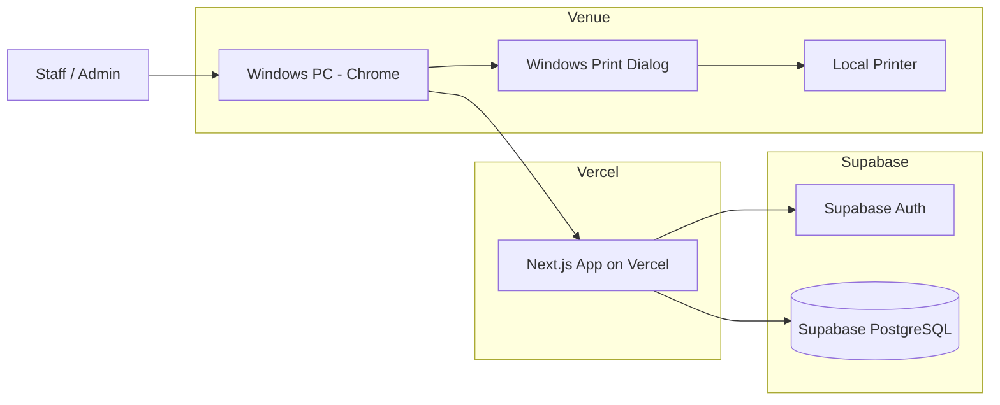
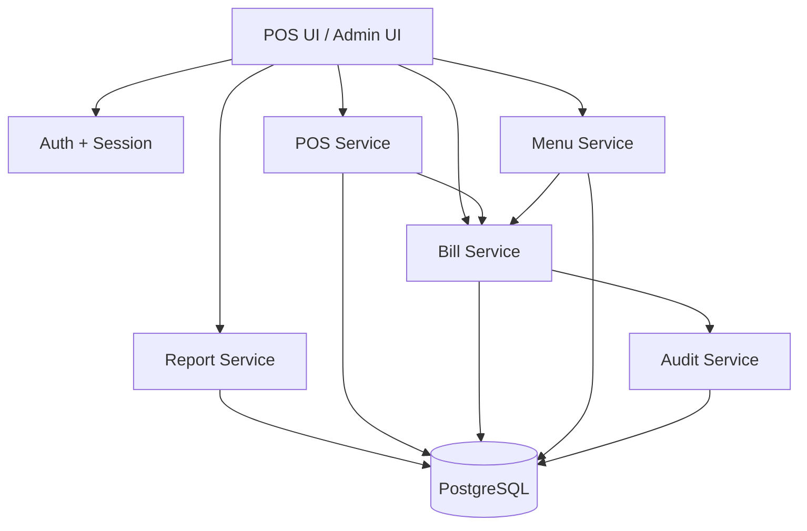
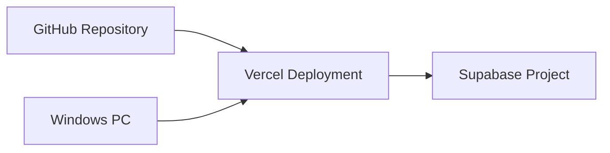

# WAAAT POS V1 — Architecture

## Current deployment decision — local PostgreSQL (25 September 2026)

The owner has superseded the original Supabase/Vercel deployment requirement for this release. The application now targets a local Next.js Docker image and a PostgreSQL 16 container, with persistent storage and a one-shot initialization container. Supabase is deferred to a future release, not required by this runtime. The original design below is retained as historical context.

Local authentication uses salted scrypt password hashes, random opaque session cookies, and SHA-256 session-token hashes stored in PostgreSQL. Sessions expire after 12 hours and are revoked on sign-out. Failed logins are throttled per normalized email in the database. Accounts are created by ADMIN; initial owner credentials are generated locally during setup. No public signup or external Auth service is used.

The application connects with a restricted `waaat_app` database login. Each business query uses a transaction, `SET LOCAL ROLE authenticated`, and a transaction-local session hash. `auth.uid()` resolves that hash to a live session; existing billing functions and RLS policies remain authoritative. The database owner credential is used only by initialization/maintenance. PostgreSQL is not published on the host network. Default app access is localhost; trusted LAN access is an explicit bind setting. HTTPS and secure cookies are required when sharing beyond a trusted local network.

See [LOCAL_POSTGRES.md](LOCAL_POSTGRES.md) for initialization, backups, recovery, sharing, and future migration boundaries.

For the implemented transaction boundaries, staff ownership rule, user provisioning, seed corrections, schema adaptations and retry recovery, see [IMPLEMENTATION_DECISIONS.md](IMPLEMENTATION_DECISIONS.md). Setup and deployment commands are in [README.md](../README.md).

## 1. Architecture style

Use a small modular monolith:
- Next.js application
- Supabase Auth
- Supabase PostgreSQL
- Vercel hosting
- Browser-based printing

Do not introduce microservices.

## 2. System diagram



## 3. Logical component diagram



## 4. Billing sequence

```mermaid
sequenceDiagram
    participant S as Staff
    participant UI as POS UI
    participant API as Next.js Server
    participant DB as Supabase DB
    participant PR as Windows Printer

    S->>UI: Select category
    S->>UI: Select product
    UI->>UI: Update cart
    S->>UI: Select payment method
    S->>UI: Save & Print
    UI->>API: Create bill + idempotency key
    API->>DB: Validate user role
    API->>DB: Read current prices
    API->>DB: Create bill + items atomically
    DB-->>API: Bill number + saved bill
    API-->>UI: Success
    UI->>PR: Open browser print dialog
    PR-->>UI: Print success/failure
    UI->>S: Bill completed; reprint available
```

## 5. Key design decisions

### Decision 1 — Vercel + Supabase
Chosen because the application is small, cloud-hosted, and operates from one computer with reliable internet.

### Decision 2 — Browser printing
The initial implementation uses a print-friendly receipt route and `window.print()`/print CSS. This avoids a native desktop wrapper.

### Decision 3 — Database owns bill numbering
Use a PostgreSQL sequence or transactional numbering mechanism. The format layer turns a numeric value into `WAAAT-%04d`.

### Decision 4 — Snapshot prices on bill items
Historical bills must remain correct even after menu price changes.

### Decision 5 — No inventory in V1
Inventory is deliberately excluded to keep the first release small.

### Decision 6 — No tax engine
Tax/charge calculation is disabled for this event. The data model should leave room for future charge/tax fields without implementing them now.

### Decision 7 — Server-side authorization
The browser may hide admin UI from staff, but permissions must also be enforced by server code and database policies.

## 6. Deployment



## 7. Environment variables

Expected examples:
- `NEXT_PUBLIC_SUPABASE_URL`
- `NEXT_PUBLIC_SUPABASE_ANON_KEY`

If a server-only Supabase service key is ever used, it must be server-only and never exposed to browser code. Prefer RLS and authenticated server clients where practical.

## 8. Reliability

- Database is the source of truth for completed bills.
- Printing is secondary.
- Reprint is always possible after a bill is saved.
- Double-click / retry protection is required.
- Financially meaningful writes must be transactional.
