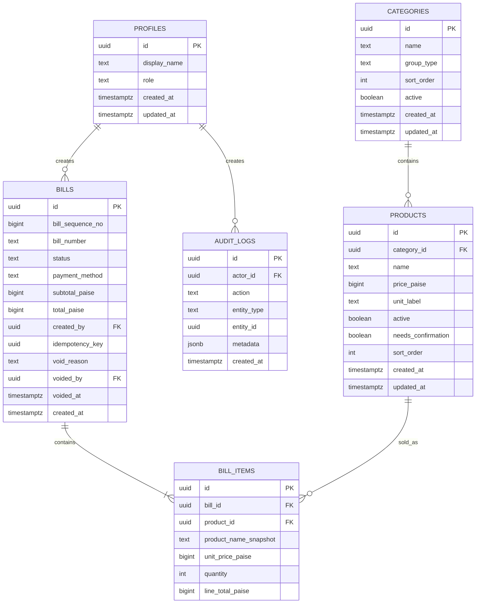

# WAAAT POS V1 — Data Model

Local deployment adds `auth.users` (normalized email and scrypt password hash), `auth.sessions` (hashed opaque token, user, expiry), and `auth.login_attempts` (persistent failed-login throttling). These are application-owned local SQL tables, not a dependency on Supabase Auth. Existing business migrations remain unchanged. `database/local/000_identity.sql` precedes them; `database/local/003_local_auth.sql` follows them. Local `auth.uid()` resolves the transaction's session hash. See [LOCAL_POSTGRES.md](LOCAL_POSTGRES.md).

Implementation amendments are in [IMPLEMENTATION_DECISIONS.md](IMPLEMENTATION_DECISIONS.md). Executable schema lives in `supabase/migrations/`; the original root SQL is a reference only. In particular, `price_paise` is nullable for inactive seasonal products, profiles include active status/email, and singleton settings plus receipt branding/unit snapshots preserve historical rendering. Financial API fields are serialized as decimal strings.

## 1. Entity relationship diagram

## 2. Recommended constraints

### PROFILES
- `role` allowed values: `ADMIN`, `STAFF`
- `display_name` required

### CATEGORIES
- `name` required
- `group_type` allowed values: `ALCOHOL`, `FOOD`, `BEVERAGE`
- `sort_order >= 0`
- Avoid hard deletion if products reference the category; deactivate instead.

### PRODUCTS
- `price_paise >= 0` for active billable items
- `unit_label` required
- `active` defaults true
- `needs_confirmation` defaults false
- If `needs_confirmation=true`, UI must not allow billing.
- Product names need not be globally unique across all time, but active duplicates in the same category should be prevented.

### BILLS
- `status` allowed values: `COMPLETED`, `VOID`
- `payment_method` allowed values: `CASH`, `UPI`, `CARD`
- `bill_number` unique
- `bill_sequence_no` unique
- `idempotency_key` unique
- `subtotal_paise = total_paise` in V1
- `void_reason` required when status is `VOID`
- `voided_by` and `voided_at` required when status is `VOID`

### BILL_ITEMS
- `quantity > 0`
- `unit_price_paise >= 0`
- `line_total_paise = unit_price_paise * quantity`

## 3. Money

Store INR in paise:
- ₹399 => `39900`
- ₹99 => `9900`
- ₹25 => `2500`

Render using an explicit formatter. Never use binary floating point for money arithmetic.

## 4. Timestamp/timezone

Store all timestamps in UTC using PostgreSQL `timestamptz`.

For "today" and date-filtered reports:
- Convert boundaries using `Asia/Kolkata`.
- Do not assume UTC midnight equals local business-day midnight.

## 5. Historical integrity

`BILL_ITEMS` contains:
- original product ID;
- product name snapshot;
- unit price snapshot.

Do not display current product price when rendering a historical bill.

## 6. Audit events

Recommended actions:
- `PRODUCT_CREATED`
- `PRODUCT_PRICE_CHANGED`
- `PRODUCT_ACTIVATED`
- `PRODUCT_DEACTIVATED`
- `BILL_VOIDED`
- `USER_ROLE_CHANGED`

Audit `metadata` can store old/new values for settings and prices.
